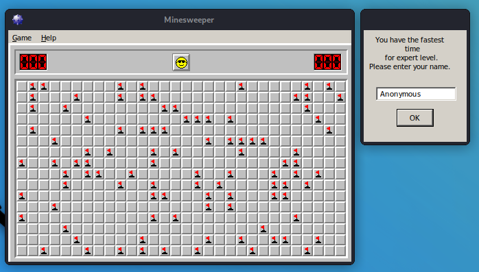

# MinesweeperHack


Hack that finishes Minesweeper on pressing '1' on the numpad.
Following the Udemy-Course "Reverse Engineering: Ghidra for Beginners" by Paul Chin I reverse-engineered 
Minesweeper until I found the address of the `void endGame(int a_won)` function. After that, it was 
easy to write a .dll that calls this function after its injection:
```C++
void endGame(int a_won) {
  typedef void (*__stdcall pFunctionAddress)(int);
  pFunctionAddress pMySecretFunction = (pFunctionAddress)(0x0100347c);
  pMySecretFunction(a_won);
}
```
I admit it's the most fragile code I've ever written. It works though 😅

 Tools
-------------------------------
 OllyDbg 2.01    Disassembler & Debugger    https://www.ollydbg.de/version2.html  
 Ghidra 10.1.2   Dissasembler & Decompiler to C-Code
 AlisInjector    https://github.com/Zuccss/Dll-INJECTOR 

 Minesweeper-Download
-------------------------------
 Minesweeper X    https://minesweepergame.com/download/minesweeper-x.php
