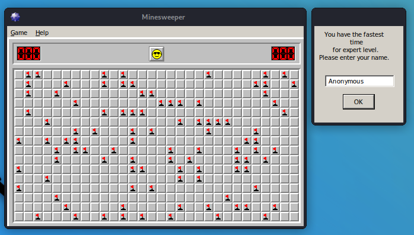

# MinesweeperHack

Entwicklung eines Minesweeper-Hacks der das Spiel auf Knopfdruck beendet.
Hierzu wurde der Kurs "Reverse Engineering: Ghidra for Beginners" von Paul Chin durchgeführt und Minesweeper mit Ghidra, einem Tool der NSA, reverse-engineered. 
Anschließend wurde eine .dll erstellt, welche injiziert wird, ihren eigenen Thread im Minesweeper-Prozess startet und auf Knopfdruck die Adresse der 'void endGame(int a_won)' Funktion aufruft.

 Tools
-------------------------------
 OllyDbg 2.01    Disassembler & Debugger    https://www.ollydbg.de/version2.html  
 Ghidra 10.1.2   Dissasembler & Decompiler to C-Code for reverse engineering  
 AlisInjector    https://github.com/Zuccss/Dll-INJECTOR 

 Minesweeper-Download
-------------------------------
 Minesweeper X    https://minesweepergame.com/download/minesweeper-x.php
